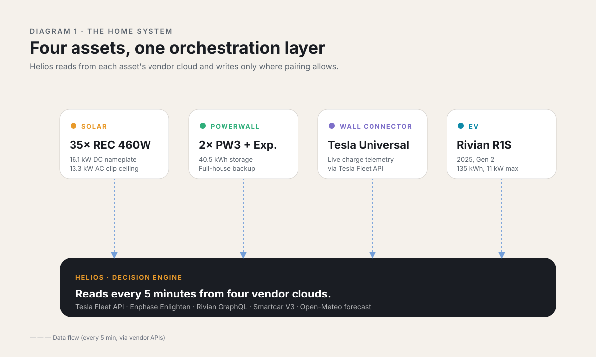
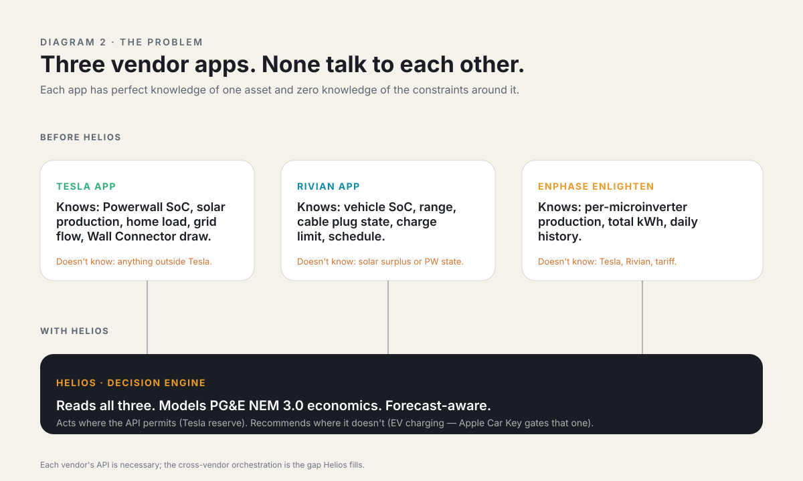
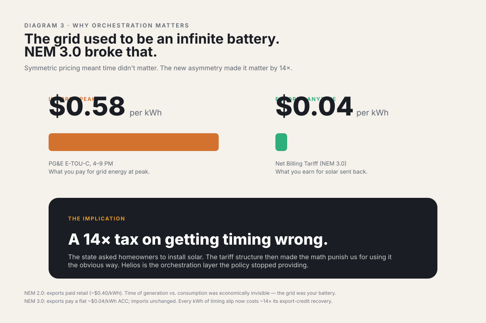
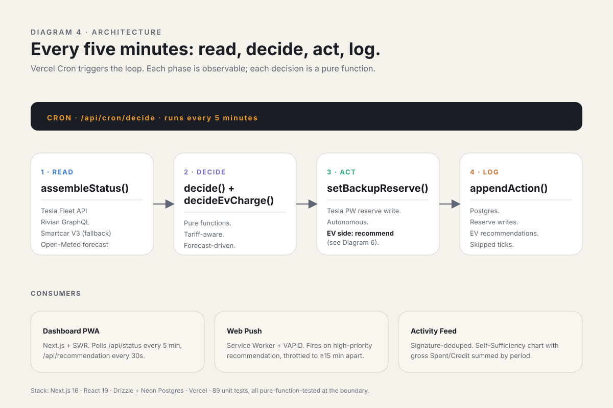
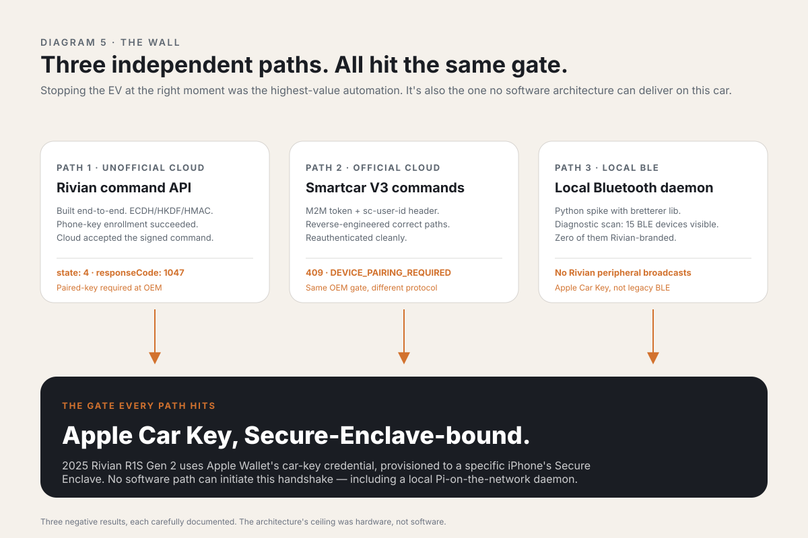
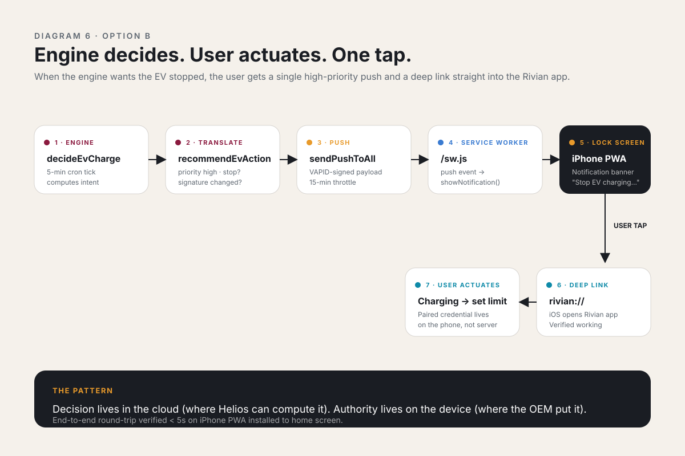
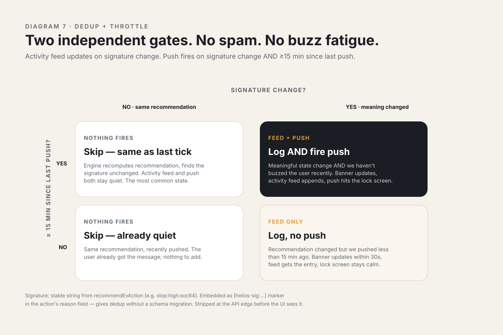
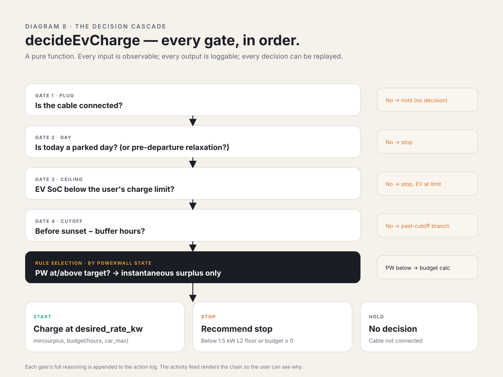

# Helios — case study diagrams

Eight conceptual diagrams that support the Helios story across two contexts:

- **In-room presentation** — each SVG is sized 1200×720 (16:9 friendly) or 1200×800; export to PNG at 2× for slide decks
- **Long-form article** — embed inline; the SVGs scale to any container width and stay sharp at any zoom level

Color palette pulled directly from the app's design tokens so the diagrams feel native to the product. Sans-serif type stack (`ui-sans-serif`, `system-ui`, `-apple-system`) renders cleanly across modern presentation tools, browsers, and PDF exports.

All eight live in `docs/diagrams/` as standalone SVG files. Embed them inline in any markdown / Notion / Keynote / Google Slides via export-to-PNG, or link directly in web articles.

---

## 1. The home system

**Filename:** `diagrams/01-home-system.svg`
**Use:** opening hero. "What does Helios actually look at?"

The four physical assets — solar array, Powerwall stack, Wall Connector, EV — and the data flow from each vendor cloud down into the Helios decision engine. Single-message diagram. Best for the first slide of a presentation or the lede image of an article.

---

## 2. The vendor-isolation problem

**Filename:** `diagrams/02-vendor-silos.svg`
**Use:** "before / with Helios" framing.

Three vendor apps as separate islands — Tesla, Rivian, Enphase — each with perfect knowledge of one asset and zero knowledge of the constraints around it. Helios bridges all three. Use this when explaining *why* the product needed to exist.

---

## 3. NEM 3.0 economic asymmetry

**Filename:** `diagrams/03-nem3-asymmetry.svg`
**Use:** the punchline that makes everything else matter.

Two big numbers side by side: $0.58/kWh import vs. $0.04/kWh export. The 14× ratio is the reason coordination across systems is worth doing. This is the single best slide for a non-technical audience — it makes the rest of the story click immediately.

---

## 4. Architecture overview

**Filename:** `diagrams/04-architecture.svg`
**Use:** technical-audience slide / article cornerstone.

The cron loop's four phases (READ → DECIDE → ACT → LOG) and the three downstream consumers (Dashboard PWA, Web Push, Activity Feed). Includes the stack at the footer. Use this when an engineering interviewer asks "what does the architecture look like?"

---

## 5. The OEM pairing wall

**Filename:** `diagrams/05-pairing-wall.svg`
**Use:** the obstacle slide of the SOAR narrative.

Three independent paths to "stop the EV charging" — Rivian unofficial command API, Smartcar V3 commands, local BLE daemon. All three hit Apple Car Key's secure-enclave gate. Each path annotated with its specific empirical failure. This is the single most powerful slide in the deck for design-leader-portfolio purposes — it shows judgment under hard ambiguity.

---

## 6. Option B notification flow

**Filename:** `diagrams/06-option-b-flow.svg`
**Use:** the resolution slide. "What did we ship instead?"

Seven steps from engine to user action: decideEvCharge → recommendEvAction → sendPushToAll → service worker → lock-screen notification → tap → Rivian app. The footer card makes the pattern explicit: *decision lives in the cloud, authority lives on the device.*

---

## 7. Signature dedup + push throttle

**Filename:** `diagrams/07-signature-throttle.svg`
**Use:** detail slide for an engineering audience; deeper article asset.

A 2×2 matrix on (signature changed?) × (≥15 min since last push?). Four quadrants describe exactly when the activity feed updates and exactly when push fires. This is the diagram that explains how the system avoids both spam and buzz fatigue.

---

## 8. The decision cascade

**Filename:** `diagrams/08-decision-cascade.svg`
**Use:** deep-dive into the engine logic.

Every gate in `decideEvCharge`, in order: plug → parked-day → SoC ceiling → cutoff → PW-state-driven rule selection → minimum-rate gate → start / stop / hold. Each gate has its escape hatch on the right side. Best for a long-form article where the reader is willing to spend a minute on technical detail.

---

## How to use these

### For an in-room presentation

1. **Open each SVG in a browser, take a high-res screenshot, save as PNG at 2× resolution.** macOS: `Cmd+Shift+4` with Retina. Or use `rsvg-convert` / `inkscape` CLI tools to batch-export.
2. **Recommended slide order for a 10-minute talk:**
   - Slide 1 (open): Diagram 1 — *the home*
   - Slide 2 (problem): Diagram 2 — *vendor silos*
   - Slide 3 (stakes): Diagram 3 — *NEM 3.0 asymmetry*
   - Slide 4 (architecture): Diagram 4 — *the cron loop*
   - Slide 5 (the wall): Diagram 5 — *three closed paths*
   - Slide 6 (the resolution): Diagram 6 — *Option B flow*
   - Slide 7 (the discipline detail): Diagram 7 — *dedup + throttle*
3. **Save Diagram 8 (decision cascade) as a reference handout** — too dense for a slide, perfect for a leave-behind.

### For a long-form article

Embed inline at section breaks. The recommended order matches the case study's existing structure:

| Section | Diagram |
|---|---|
| TL;DR / hero | 1 |
| Why I built it | 2, 3 |
| Architecture | 4 |
| The journey: hitting the wall | 5 |
| The journey: pivoting to Option B | 6 |
| What I'm proud of | 7, 8 |

### For social / portfolio thumbnails

Use Diagrams 3 and 5 — they're the most visually striking single-message ones. Both work as 16:9 thumbnails.

---

## Editing

Every diagram is hand-rolled SVG with the design tokens inlined. To change colors globally, search-and-replace the hex values across `docs/diagrams/`:

| Token | Hex | Used in |
|---|---|---|
| `--solar` | `#E89A2B` | Solar references, accent highlights |
| `--battery` | `#2FAE7A` | Powerwall references, "go" states |
| `--vehicle` | `#0E8AA8` | EV / Rivian references |
| `--grid` | `#3A7BD1` | Grid / data flow |
| `--home` | `#7D6FC9` | House / decision engine |
| `--alert` | `#D2722E` | Failure paths, warnings |
| `--text-primary` | `#1A1D23` | Headlines, dark surfaces |
| `--text-secondary` | `#5D6670` | Body text, secondary labels |
| `--surface-warm` | `#F5F1EB` | Page background |

Type stack: `ui-sans-serif, system-ui, -apple-system, BlinkMacSystemFont, 'Segoe UI', sans-serif`. Will render as San Francisco on macOS, Segoe UI on Windows, system equivalent on Linux/Android.
